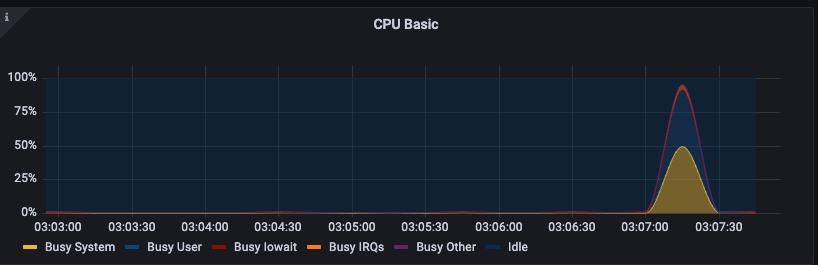
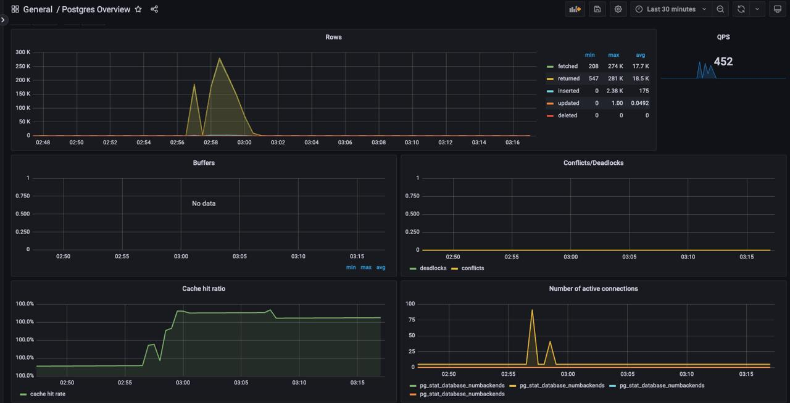
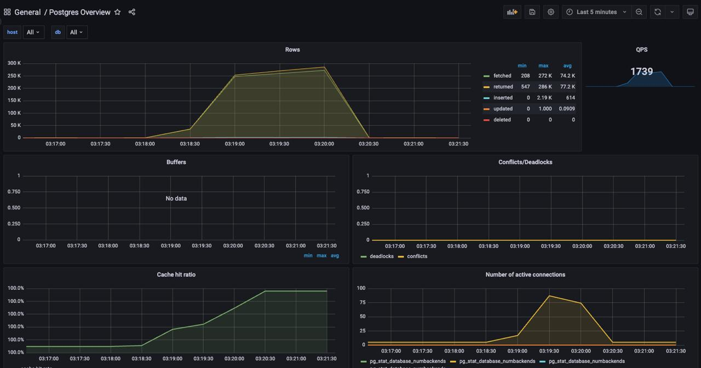

# HW1 – Нагрузочное тестирование demo-app-1

## 1. На какие метрики нужно смотреть

Шин В.А. МКС244

### 1.1. Метрики приложения (SLI)

Основные метрики, отражающие состояние системы с точки зрения пользователя:
- latency (p95 / p99)
- error rate (5xx, 502, 504)
- RPS / QPS

По этим метрикам определяется момент деградации и отказа системы.

---

### 1.2. Метрики CPU (backend)



На графике видно резкое увеличение загрузки CPU (Busy User и Busy System) почти до 100% при запуске нагрузочного теста.  
Idle в этот момент практически отсутствует.

Это указывает на то, что backend становится CPU-bound. При дальнейшем росте нагрузки приложение не успевает обрабатывать запросы, что приводит к росту latency и последующим ошибкам.

---

### 1.3. Метрики PostgreSQL (умеренная нагрузка)



При первом прогоне сценария наблюдается нагрузка порядка ~450 QPS.  
Количество активных соединений увеличивается, но остаётся в допустимых пределах.  
Deadlocks и конфликты отсутствуют, cache hit ratio близок к 100%.

PostgreSQL при данной нагрузке работает стабильно и не является узким местом системы.

---

### 1.4. Метрики PostgreSQL (высокая нагрузка)



При увеличении нагрузки QPS возрастает примерно до ~1700.  
Число активных соединений достигает 80–90.  
Deadlocks по-прежнему отсутствуют, cache hit ratio остаётся высоким.

База данных продолжает обслуживать запросы, однако возрастает давление на backend из-за увеличения времени обработки и числа параллельных соединений.

---

### 1.5. Вывод по bottleneck

- Disk I/O не является узким местом
- Deadlocks и конфликты в БД отсутствуют
- Основное узкое место – CPU backend
- Вторичное узкое место – количество соединений с PostgreSQL

---

## 2. Сценарии нагрузки

### 2.1. Шторм (резкий пик)

Резкий рост числа пользователей до большого значения за короткое время.  
Цель – проверить устойчивость системы к внезапным пиковым нагрузкам.

```bash
vayzer@vm1 demo-app-1 % k6 run load-script.js

         /\      Grafana   /‾‾/  
    /\  /  \     |\  __   /  /   
   /  \/    \    | |/ /  /   ‾‾\ 
  /          \   |   (  |  (‾)  |
 / __________ \  |_|\_\  \_____/ 

     execution: local
        script: load-script.js
        output: -

     scenarios: (100.00%) 1 scenario, 1000 max VUs, 40s max duration (incl. graceful stop):
              * default: Up to 1000 looping VUs for 10s over 1 stages (gracefulRampDown: 30s, gracefulStop: 30s)


  █ TOTAL RESULTS 

    checks_total.......: 27978  2553.405295/s
    checks_succeeded...: 49.50% 13852 out of 27978
    checks_failed......: 50.49% 14126 out of 27978

    ✗ created
      ↳  41% — ✓ 6708 / ✗ 9550
    ✗ list ok
      ↳  83% — ✓ 3311 / ✗ 670

    HTTP
    http_req_duration..............: avg=213.38ms min=615µs   med=142.73ms max=3.13s p(90)=467.06ms p(95)=591.2ms 
      { expected_response:true }...: avg=215.2ms  min=742µs   med=112.58ms max=3.13s p(90)=491.71ms p(95)=609.25ms
    http_req_failed................: 50.49% 14126 out of 27978
    http_reqs......................: 27978  1824.405295/s

    EXECUTION
    iteration_duration.............: avg=213.67ms min=50.73ms med=92.88ms max=3.18s p(90)=417.52ms p(95)=541.38ms
    iterations.....................: 27978  1824.405295/s
    vus............................: 945    min=96             max=995 
    vus_max........................: 1000   min=1000           max=1000

    NETWORK
    data_received..................: 61 MB  4.7 MB/s
    data_sent......................: 5.5 MB 444 kB/s
```

Ключевые результаты:
- checks_total ≈ 28k
- успешные проверки ≈ 50%
- error rate ≈ 50%
- пропускная способность ≈ 2.5k req/s
- p95 latency ≈ 550–600 ms
- max latency > 2.5 s

При данном сценарии наблюдается резкий рост загрузки CPU backend до предельных значений.
Система не успевает обрабатывать входящие запросы, что приводит к большому количеству ошибок.

PostgreSQL при этом остаётся стабильным – количество соединений не упирается в лимиты, блокировки отсутствуют.

---

### 2.2. Волна (плавный рост)

Плавное увеличение числа пользователей с выходом на плато.  
Цель – определить границу пропускной способности системы и момент деградации.

```bash
vayzer@vm1 demo-app-1 % k6 run load-script.js

         /\      Grafana   /‾‾/  
    /\  /  \     |\  __   /  /   
   /  \/    \    | |/ /  /   ‾‾\ 
  /          \   |   (  |  (‾)  |
 / __________ \  |_|\_\  \_____/ 

     execution: local
        script: load-script.js
        output: -

     scenarios: (100.00%) 1 scenario, 1000 max VUs, 4m30s max duration (incl. graceful stop):
              * default: Up to 1000 looping VUs for 4m0s over 4 stages (gracefulRampDown: 30s, gracefulStop: 30s)


  █ TOTAL RESULTS 

    checks_total.......: 251483 1994.42411/s
    checks_succeeded...: 56.77% 142767 out of 251483
    checks_failed......: 43.22% 108716 out of 251483

    ✗ created
      ↳  94% — ✓ 47079 / ✗ 2808
    ✗ list ok
      ↳  47% — ✓ 95688 / ✗ 105908

    HTTP
    http_req_duration..............: avg=173.58ms min=581µs   med=29.23ms max=6.98s p(90)=482.81ms p(95)=849.01ms
      { expected_response:true }...: avg=86.55ms  min=711µs   med=18.76ms max=6.43s p(90)=175.87ms p(95)=417.7ms 
    http_req_failed................: 43.22% 108716 out of 251483
    http_reqs......................: 251483 2092.42411/s

    EXECUTION
    iteration_duration.............: avg=223.92ms min=50.64ms med=79.53ms max=7.03s p(90)=533.42ms p(95)=899.39ms
    iterations.....................: 251483 994.42411/s
    vus............................: 499      min=1                max=998 
    vus_max........................: 500   min=1000             max=1000

    NETWORK
    data_received..................: 570 MB 4.1 MB/s
    data_sent......................: 44 MB  273 kB/s

```

Ключевые результаты:
- checks_total ≈ 250k
- успешные проверки ≈ 56–57%
- error rate ≈ 43%
- пропускная способность ≈ 2.0–2.1k req/s
- p95 latency ≈ 800–900 ms
- max latency ≈ 6–7 s

При плавном росте нагрузки система демонстрирует более стабильное поведение.
После прохождения пика нагрузки backend корректно восстанавливается.

Метрики PostgreSQL показывают:
- плавный рост числа соединений
- отсутствие deadlocks
- высокий cache hit ratio

---

## 3. Как и когда система падает

Ожидаемый сценарий отказа:

1. Рост VU приводит к росту QPS
2. CPU backend достигает 80–100%
3. Начинает расти p95 / p99 latency
4. Backend дольше удерживает соединения с БД
5. Растёт количество активных DB connections
6. Backend начинает возвращать 500
7. NGINX отдаёт 502 / 504

Фактический отказ системы происходит на уровне backend-приложения, а не базы данных.

---

## 4. Предложения по улучшению

### 4.1. Быстрые решения
- Настроить и ограничить пул соединений с PostgreSQL
- Ограничить количество параллельных запросов в backend
- Уменьшить кардинальность метрик (не использовать raw path в labels)

---

### 4.2. Среднесрочные решения
- Горизонтальное масштабирование backend
- Кэширование часто используемых GET-запросов

---

### 4.3. Архитектурные решения
- Использование read-replica PostgreSQL
- Асинхронная обработка тяжёлых операций записи

---

## Выводы

В ходе выполнения работы были проведены нагрузочные тесты системы demo-app-1 с использованием различных сценариев нагрузки.

Система чувствительна к резким пиковым нагрузкам. В сценарии «Шторм» backend не справляется с обработкой запросов, что приводит к высокой загрузке CPU, росту latency и большому количеству ошибок.

При плавном увеличении нагрузки («Волна») система ведёт себя заметно стабильнее, деградация происходит постепенно, и после снижения нагрузки сервис корректно восстанавливается.

Основным узким местом системы является backend-приложение, ограниченное вычислительными ресурсами CPU. PostgreSQL в рамках проведённых тестов не является первичным bottleneck и стабильно обслуживает запросы.

Таким образом, текущая архитектура требует доработок для устойчивой работы при пиковых нагрузках. Предложенные меры позволяют повысить отказоустойчивость и масштабируемость системы.
